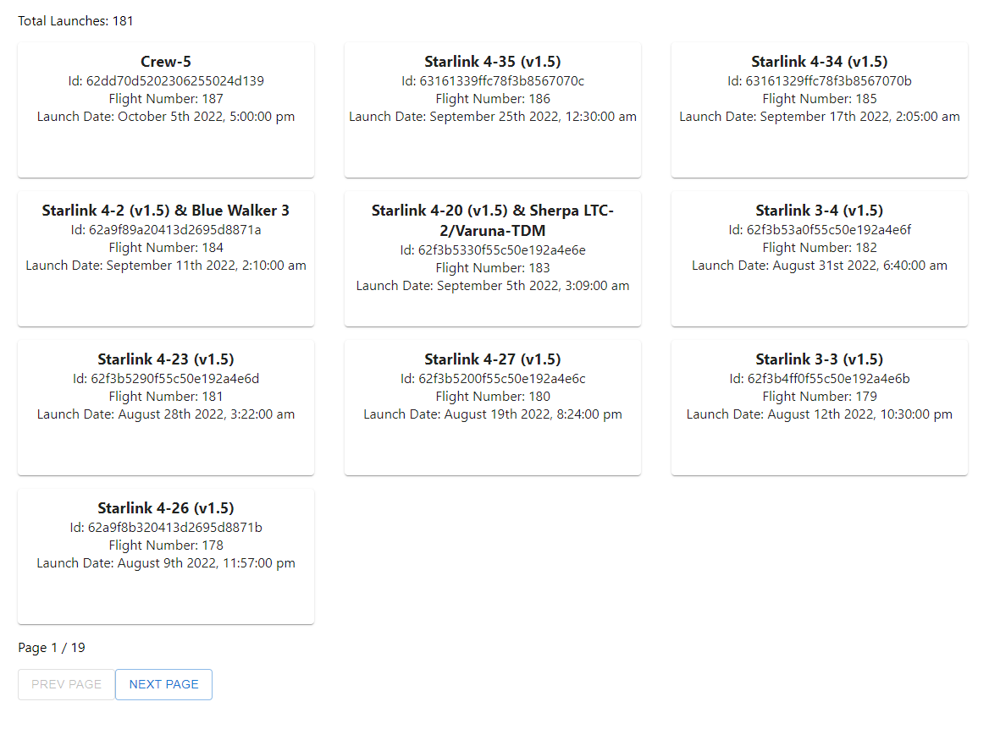

# Frontend Developer Tech Test

You have been provided with a complete API that returns an array of successful SpaceX launches.

Pagination is already handled for you in app.js, this can be enhanced if you wish

Currently, the app displays the following:



Your task is to style this information in whatever way you feel.  Have fun and show off your frontend skills!

### Restrictions!

 - MaterialUI, momentJS, moment-timezone and your own CSS and JS skills are all you can use
 - Do not play with the API call - data is the data!
 - Do not spend more than 3 hours on this

Below is an example launch object:

```json
{
    "links": {
        "patch": {
            "small": "https://images2.imgbox.com/ae/3c/yVvE2vVh_o.png",
            "large": "https://images2.imgbox.com/82/c7/bbs0gt88_o.png"
        },
        "reddit": {
            "campaign": null,
            "launch": "http://www.reddit.com/r/spacex/comments/22zo8c",
            "media": null,
            "recovery": null
        },
        "flickr": {
            "small": [],
            "original": [
                "https://farm8.staticflickr.com/7615/16670240949_8d43db0e36_o.jpg",
                "https://farm9.staticflickr.com/8597/16856369125_e97cd30ef7_o.jpg",
                "https://farm8.staticflickr.com/7586/16166732954_9338dc859c_o.jpg",
                "https://farm8.staticflickr.com/7603/16855223522_462da54e84_o.jpg",
                "https://farm8.staticflickr.com/7618/16234010894_e1210ec300_o.jpg",
                "https://farm8.staticflickr.com/7617/16855338881_69542a2fa9_o.jpg"
            ]
        },
        "presskit": "http://www.spacex.com/sites/spacex/files/spacexcrs-3_presskit_042014.pdf",
        "webcast": "https://www.youtube.com/watch?v=Od-lON4bTyQ",
        "youtube_id": "Od-lON4bTyQ",
        "article": "https://newatlas.com/crs-3-launch-spacex/31671/",
        "wikipedia": "https://en.wikipedia.org/wiki/SpaceX_CRS-3"
    },
    "rocket": {
        "height": {
            "meters": 70,
            "feet": 229.6
        },
        "diameter": {
            "meters": 3.7,
            "feet": 12
        },
        "mass": {
            "kg": 549054,
            "lb": 1207920
        },
        "flickr_images": [
            "https://farm1.staticflickr.com/929/28787338307_3453a11a77_b.jpg",
            "https://farm4.staticflickr.com/3955/32915197674_eee74d81bb_b.jpg",
            "https://farm1.staticflickr.com/293/32312415025_6841e30bf1_b.jpg",
            "https://farm1.staticflickr.com/623/23660653516_5b6cb301d1_b.jpg",
            "https://farm6.staticflickr.com/5518/31579784413_d853331601_b.jpg",
            "https://farm1.staticflickr.com/745/32394687645_a9c54a34ef_b.jpg"
        ],
        "name": "Falcon 9",
        "type": "rocket",
        "description": "Falcon 9 is a two-stage rocket designed and manufactured by SpaceX for the reliable and safe transport of satellites and the Dragon spacecraft into orbit.",
        "id": "5e9d0d95eda69973a809d1ec"
    },
    "crew": [],
    "capsules": [
        {
            "serial": "C105",
            "status": "unknown",
            "type": "Dragon 1.1",
            "id": "5e9e2c5bf3591859a63b2668"
        }
    ],
    "payloads": [
        {
            "name": "CRS-3",
            "type": "Dragon 1.1",
            "orbit": "ISS",
            "reference_system": "geocentric",
            "regime": "low-earth",
            "id": "5eb0e4bbb6c3bb0006eeb1f1"
        }
    ],
    "launchpad": {
        "name": "CCSFS SLC 40",
        "full_name": "Cape Canaveral Space Force Station Space Launch Complex 40",
        "locality": "Cape Canaveral",
        "region": "Florida",
        "latitude": 28.5618571,
        "longitude": -80.577366,
        "details": "SpaceX's primary Falcon 9 pad, where all east coast Falcon 9s launched prior to the AMOS-6 anomaly. Previously used alongside SLC-41 to launch Titan rockets for the US Air Force, the pad was heavily damaged by the AMOS-6 anomaly in September 2016. It returned to flight with CRS-13 on December 15, 2017, boasting an upgraded throwback-style Transporter-Erector modeled after that at LC-39A.",
        "id": "5e9e4501f509094ba4566f84"
    },
    "flight_number": 14,
    "name": "CRS-3",
    "date_utc": "2014-04-18T19:25:00.000Z",
    "id": "5eb87ce4ffd86e000604b337"
}

```

### Available Scripts

In the project directory, you can run the standard React scripts:

### `npm start`

Runs the app in the development mode.\
Open [http://localhost:3000](http://localhost:3000) to view it in your browser.

### `npm test`

Launches the test runner in the interactive watch mode.\

### `npm run build`

Builds the app for production to the `build` folder.\

### `npm run eject`

**Note: this is a one-way operation. Once you `eject`, you can't go back!**

If you aren't satisfied with the build tool and configuration choices, you can `eject` at any time. This command will remove the single build dependency from your project.
